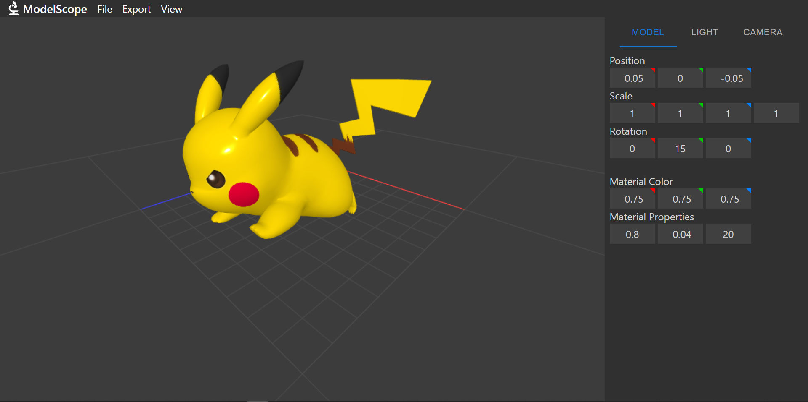

# ModelScope3D
A 3D model editor web app developed in TypeScript and using WebGL.

ModelScope3D allows you to view and transform your models in high quality with customizable lighting, material options, and camera effects.

## Key Features
- Add and fine-tune multiple light sources to create the perfect scene.
- View your models with mapped textures in real time.
- Configure material properties for models without textures.
- Apply precise transformations with versatile tools.
- Export models to other supported file formats.

## Sample Renders

